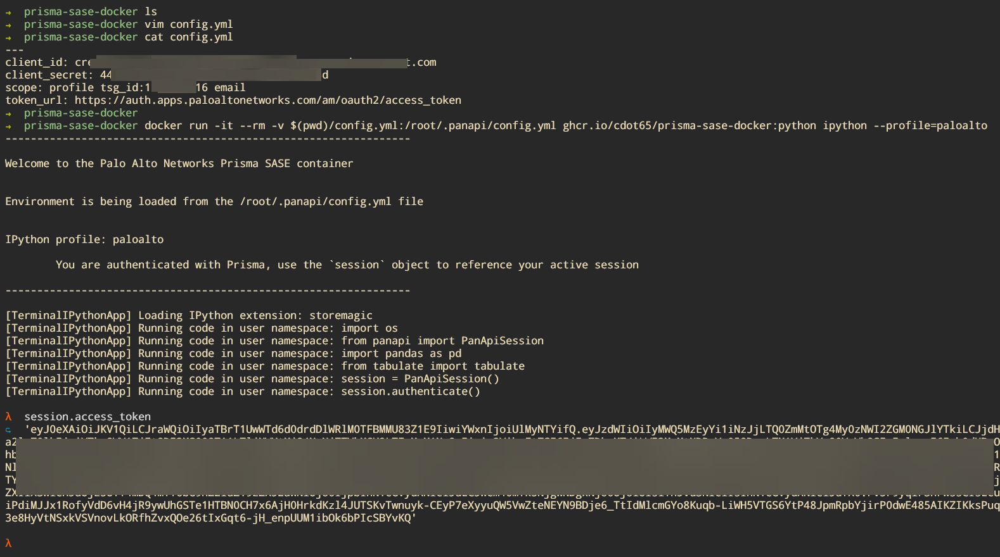
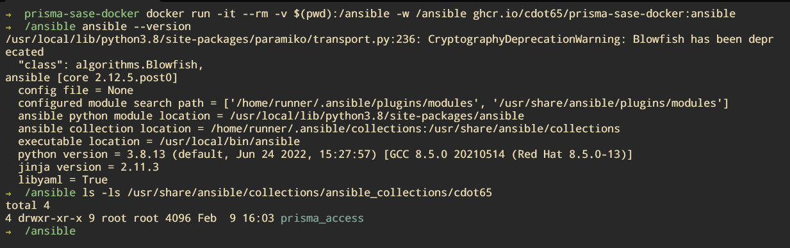

# prisma-sase-docker

[](https://www.paloaltonetworks.com/)

- [prisma-sase-docker](#prisma-sase-docker)
  - [`Overview`](#overview)
  - [`Features`](#features)
    - [`Python Container Features`](#python-container-features)
    - [`Ansible Container Features`](#ansible-container-features)
  - [`How to use this repository`](#how-to-use-this-repository)
  - [`Prerequisites`](#prerequisites)
  - [`Using the SASE container images`](#using-the-sase-container-images)
    - [`Python Container Image`](#python-container-image)
    - [`Ansible Container Image`](#ansible-container-image)
  - [`Building the container images`](#building-the-container-images)

## `Overview`

The goal of this repository is to provide Docker containers for learning how to automate Palo Alto Networks Prisma products.

## `Features`

### `Python Container Features`

This container image will provide you with an interactive Python environment with the following additions:

- Prisma Access SDK (`panapi`) loaded
- Automatically form an authenticated session with Prisma upon container start
- Drops you into an interactive Python REPL using `ipython`
- Historical commands are saved
- Tab completion is enabled
- Contextual highlighting is enabled

### `Ansible Container Features`

Using this container image will provide you with an interactive ZSH shell with these additional benefits:

- Latest version of Ansible installed
- Provides the latest version of Prisma Access Ansible Collections
- Provide the necessary Python SDK package and dependencies
- Historical commands are saved
- Tab completion is enabled

## `How to use this repository`

There is no need to clone this repository to use the Docker container images, you can simply pull them directly from the GitHub Container Registry (GHCR) by using the instructions found at [Pulling down the container images](#pulling-down-the-container-images).

If you are looking to either build the containers or make modifications to the images, you will found the instructions at [Building the container images](#building-the-container-images).

If you are interesting in taking advantage of the example scripts found in the [examples](examples/) directory, you will follow the instructions [Building the container images](#python-container-image) most helpful.

## `Prerequisites`

- Docker

## `Using the SASE container images`

You can pull down the container images by using the following commands:

```bash
docker pull ghcr.io/cdot65/prisma-sase-docker:python
docker pull ghcr.io/cdot65/prisma-sase-docker:ansible
```

Since the images are devoid of any automation scripts, you will need to mount your automation files into the container at run time. You can find more information about this in the [Python Container Image](#python-container-image) and [Ansible Container Image](#ansible-container-image) sections.

### `Python Container Image`

To use the Python container, you will use the `prisma-sase-docker:python` container tag.

There is a requirement for a `config.yml` file on your machine, this file is used to authenticate with Prisma Access and is passed into our container during the `docker run` command.

1. Rename `config.yml.example` file in the directory (`examples/python/config.yml.example`) to `config.yml`

2. Update the `config.yml` file with your Prisma Access credentials

   ```yaml
   ---
   client_id: jennyjenny@8008675309.iam.panserviceaccount.com
   client_secret: 18675309-abcd-abcd-abcd-18008675309
   scope: profile tsg_id:8008675309 email
   token_url: https://auth.apps.paloaltonetworks.com/am/oauth2/access_token
   ```

3. Mount this file and gain access to container's Python REPL by typing the following command:

```bash
docker run -it -v $(pwd)/examples/python/config.yml:/root/.panapi/config.yml ghcr.io/cdot65/prisma-sase-docker:python ipython --profile=paloalto
```



### `Ansible Container Image`

If you'd like to use the Ansible container, you will use the `prisma-sase-docker:ansible` container tag.

There is no need for a `config.yml` file with Ansible because the authentication variables will need to be passed into the playbook instead of loading them at run time. There are many ways of getting variables into Ansible playbooks, but the easiest way is to use a `group_vars` file. Here is an example project directory structure:

```shell
ansible-project
├── playbook.yaml
├── ansible.cfg
├── group_vars
│   └── all
│       └── authentication.yaml
└── inventory.yaml
```

1. Rename `authentication.yaml.example` file in the directory (`examples/ansible/group_vars/all/authentication.yaml.example`) to `authentication.yaml`

2. Update the `authentication.yaml` file with your Prisma Access credentials

   ```yaml
   ---
   client_id: "jennyjenny@8675309.iam.panserviceaccount.com"
   client_secret: "18675309-5309-5309-5309-86753095309"
   scope: "867530901"
   ```

   > ⚠️ **Encrypt your authentication.yaml file!**
   >
   > ⚠️ It is _HIGHLY_ encouraged that you protect this file by encrypting it with Ansible Vault. You can learn more about Ansible Vault [here](docs/vault.md)

3. To run the Ansible container, you will need to mount your project directory into the container and set the working directory to the project directory. Here is an example command:

```bash
docker run -it -v $(pwd)/examples/ansible:/ansible -w /ansible ghcr.io/cdot65/prisma-sase-docker:ansible
```



## `Building the container images`

If you would like to build the container images yourself, you can do so by following the instructions below.

1. Clone this repository

   ```bash
   git clone https://github.com/cdot65/prisma-sase-docker.git
   ```

2. Change into the repository directory

   ```bash
   cd prisma-sase-docker
   ```

3. Build the Python container image

   ```bash
   docker build -t prisma-sase-docker:python docker/python
   ```

4. Build the Ansible container image

   ```bash
   docker build -t prisma-sase-docker:ansible docker/ansible
   ```
