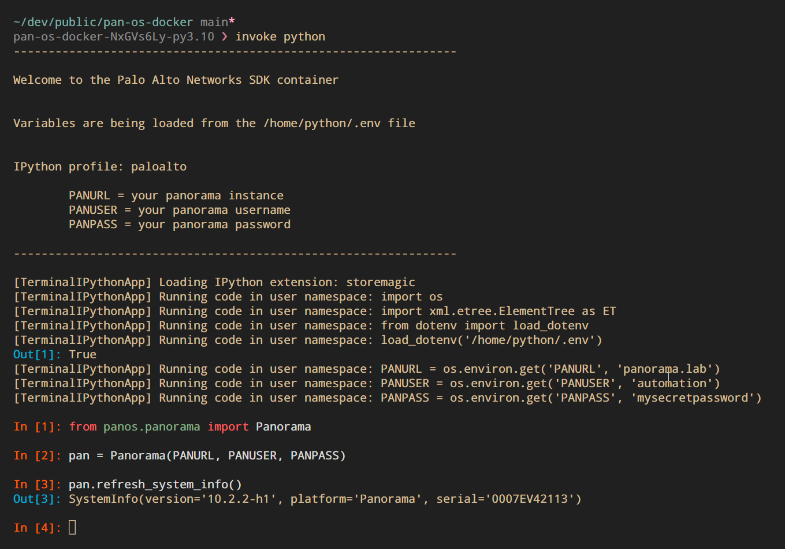

# prisma-sase-docker

[](https://www.paloaltonetworks.com/)

## `Overview`

The goal of this repository is to provide a Docker container for learning how to automate Palo Alto Networks Prisma products.

### Python

Python environment is provided by the `prisma-sase-docker:python` container tag. Using this container image will provide you with an interactive Python environment with the following additions:

- Prisma Access SDK (`panapi`) loaded
- all Python files stored within the [python](./python/) mounted at `/home/python`

You can gain access to container's Python REPL from the root of this project by typing the following command:

```bash
invoke python
```

If you would like to execute scripts within the your workstation's [python](./python/) directory, you will find them mounted at `/home/python` within the container's shell, which can be accessed with:

```bash
invoke shell --python
```

If you would not like to build this container locally and feel comfortable using a pre-packaged version, simply run the appropriate command below.

```bash
# Python REPL
docker run -it --rm \
    -w /home/python \
    ghcr.io/cdot65/prisma-sase-docker:python ipython --profile=paloalto

# Container shell
docker run -it --rm \
    -v "$(pwd)"/python:/home/python \
    -w /home/python/ \
    ghcr.io/cdot65/prisma-sase-docker:python /bin/sh
```

### Ansible

An Ansible environment is provided by the `prisma-sase-docker:ansible` container tag. Using this container image will provide you with an interactive Python environment with the following additions:

- automatically provide the latest Ansible Collections
- provide necessary Python SDK library and dependencies

If you would like to execute Ansible playbooks within the your workstation's [ansible](./ansible/) directory, you will find them mounted at `/home/ansible` within the container's shell, which can be accessed with:

```bash
invoke shell --ansible
```

If you would not like to build this container locally and feel comfortable using a pre-packaged version, simply run the command below.

```bash
# Container shell
docker run -it --rm -v $(pwd):/ansible -w /ansible ghcr.io/cdot65/prisma-sase-docker:ansible
```

### Building the Python container

Build your Python container with the following invoke command:

```bash
invoke build --python
```

Start your container and jump into the Python interpreter with:

```bash
invoke python
```


